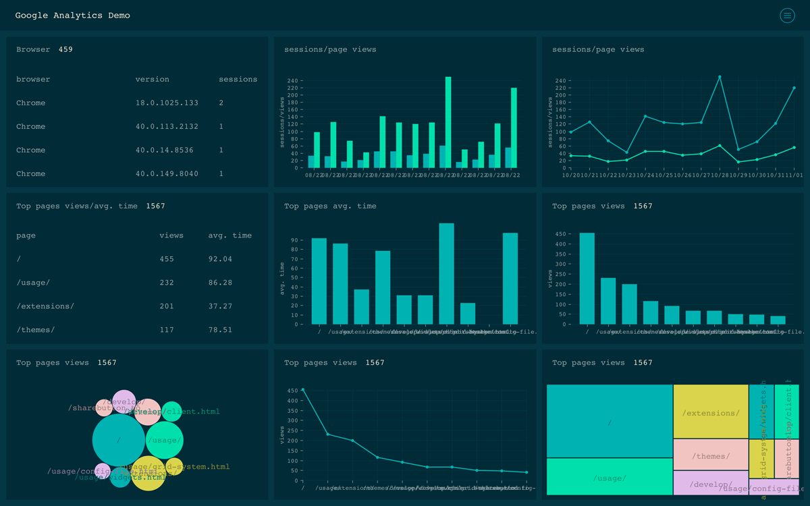
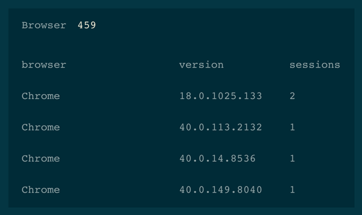
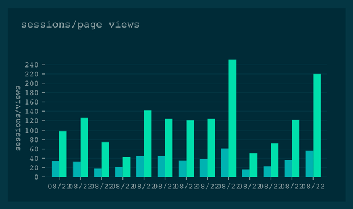
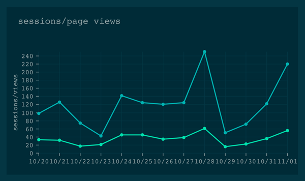
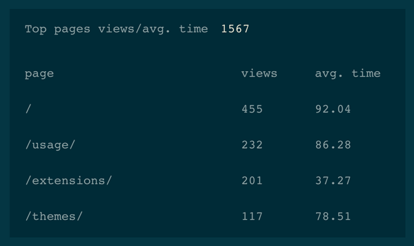
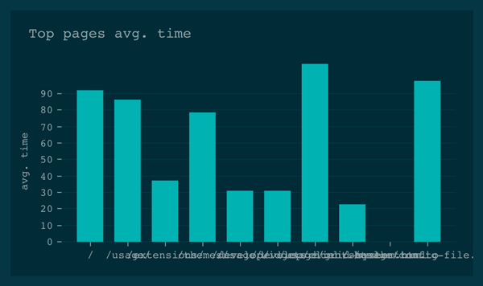
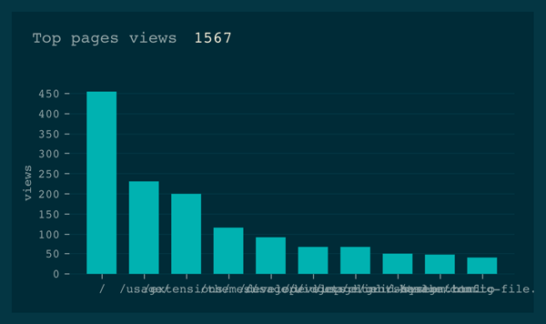
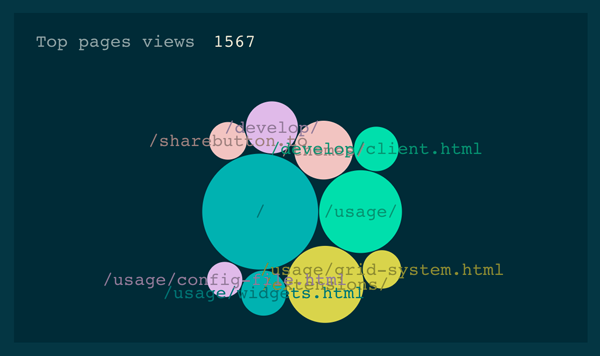
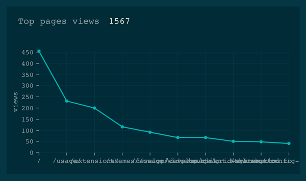
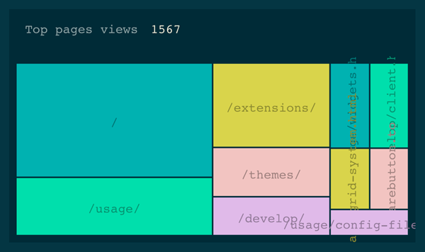

# mozaik-ext-analytics

[![License][license-image]][license-url]
[![NPM version][npm-image]][npm-url]
![widget count][widget-count-image]

This module provides some Google Analytics widgets for [Mozaïk](http://mozaik.rocks) dashboards.



**Table of contents**
<!-- MarkdownTOC depth=0 autolink=true bracket=round -->

- [Setup](#setup)
  - [Install](#install)
  - [Google Analytics](#google-analytics)
- [Widgets](#widgets)
  - [`<Browser />`](#browser)
  - [`<PageViews />`](#pageviews)
  - [`<PageViewsLine />`](#pageviewsline)
  - [`<TopPages />`](#toppages)
  - [`<TopPagesAvgTimeBar />`](#toppagesavgtimebar)
  - [`<TopPagesViewsBar />`](#toppagesviewsbar)
  - [`<TopPagesViewsBubble />`](#toppagesviewsbubble)
  - [`<TopPagesViewsLine />`](#toppagesviewsline)
  - [`<TopPagesViewsTreeMap />`](#toppagesviewstreemap)
- [Reusable config](#reusable-config)  
- [License](#license)
- [Credit](#credit)

<!-- /MarkdownTOC -->


## Setup

Follow these steps to install and configure extension's widgets into your dashboard.

### Install

- Install extension:

  ```sh
  npm install -S mozaik-ext-analytics
  ```
  
  or using yarn
  
  ```sh
  yarn add mozaik-ext-analytics
  ```

- Register client api by adding to dashboard `server.js`:

  ```javascript
  // …
  Mozaik.registerApi('analytics', require('mozaik-ext-analytics/client'))
  ```

- Register widgets by adding to dashboard `src/index.js`:

  ```javascript
  import { Registry } from '@mozaik/ui'
  import analytics from 'mozaik-ext-analytics'

  Registry.addExtensions({
      analytics,
  })
  ```

- (Re)build the dashboard:

  ``` sh
  npm run build
  ```
  
  or using yarn
  
  ```sh
  yarn run build
  ```

- Configure widgets (see Widgets -section)
- Start dashboard: `node server.js config.yml`

### Google Analytics

- Login to Developers Console: https://console.developers.google.com/
  (register Google account if you don't already have one)

- Create new project `dashboard` (or similar)

- Enable following `Analytics API` from permissions

- Create *Service account* under Credentials:
  Create new Client ID -> Service account -> Download mozaik-ext-analytics.p12 file

- Convert .p12 file into .pem format with command:

  ```shell
  openssl pkcs12 -in mozaik-ext-analytics*.p12 -nodes -nocerts > mozaik-ext-analytics.pem
  ```

  The password for .p12 file is `notasecret`

- Authorize service user to acces analytics *property* in question by adding the service
  email address via User Management

- Configure service auth details in dashboard root file: `.env` (or as environment variables):

  ```shell
  GOOGLE_SERVICE_EMAIL=generated-by-google-console@developer.gserviceaccount.com
  # one of the following:
  GOOGLE_SERVICE_KEY=abcdef123456...
  GOOGLE_SERVICE_KEYPATH=mozaik-ext-analytics.pem
  ```

  Alternatively use `export` command to set environment variables.

- Run command line app to retrieve ids (or see them from analytics - see references):

  ``` sh
  ./node_modules/mozaik-ext-analytics/bin/mozaik-analytics --keypath PATH_TO_JSON_KEY_FILE profiles
  ```

  **OR**

  - [Navigate to Analytics api explorer](https://developers.google.com/apis-explorer/#p/analytics/v3/analytics.management.accountSummaries.list?_h=2&)
  - Authorize request from OAuth 2.0 button in top-right corner
  - Select the wanted id from wanted `profiles[n].id` field

### Widgets

Because all Mozaïk demos load config vars using `dotenv` module, you don't have to manually load them.
You just have to add some widgets to configuration file (usually `config.yml`).

```yaml
# config.yml
# …
dashboards:
- title:   Google Analytics Demo
  columns: 3
  rows:    3
  widgets:
  -
    extension: analytics
    widget:    Browser
    id:        xxxxxxxx
    startDate: 15daysAgo
    columns:   1
    rows:      1
    x:         0
    y:         0
  # …
```

Finally, start the dashboard with command:

```sh
node server.js
```

### Browser

> Display browser stats (table).



#### parameters

key           | required | description
--------------|----------|---------------
`id`          | yes      | *Id of the analytics data to show. See setup steps or analytics view for more info. Example: `1231234321`*
`startDate`   | no       | *Starting date info used in Analytics. Example/default: '30daysAgo'*
`endDate`     | no       | *End date info used in Analytics. Example/default: 'yesterday'*
`title`       | no       | *Textual title to show. Example: 'My website'.*

#### usage

``` yaml
# config.yml
dashboards:
- # …
  widgets:
  - extension: analytics
    widget:    Browser
    id:        xxxxxxxx
    columns:   1
    rows:      1
    x:         0
    y:         0
```


### PageViews

> Bar chart showing page views & sessions for given period.



#### parameters

key           | required | description
--------------|----------|---------------
`id`          | yes      | *Id of the analytics data to show. See setup steps or analytics view for more info. Example: `1231234321`*
`startDate`   | no       | *Starting date info used in Analytics. Example/default: '30daysAgo'*
`endDate`     | no       | *End date info used in Analytics. Example/default: 'yesterday'*
`title`       | no       | *Textual title to show. Example: 'My website'.*

#### Usage

``` yaml
# config.yml
dashboards:
- # …
  widgets:
  - extension: analytics
    widget:    PageViews
    id:        xxxxxxxx
    columns:   1
    rows:      1
    x:         0
    y:         0
```


### PageViewsLine

> Line chart showing page views & sessions for given period.



#### parameters

key           | required | description
--------------|----------|---------------
`id`          | yes      | *Id of the analytics data to show. See setup steps or analytics view for more info. Example: `1231234321`*
`startDate`   | no       | *Starting date info used in Analytics. Example/default: '30daysAgo'*
`endDate`     | no       | *End date info used in Analytics. Example/default: 'yesterday'*
`title`       | no       | *Textual title to show. Example: 'My website'.*

#### Usage

``` yaml
# config.yml
dashboards:
- # …
  widgets:
  - extension analytics
    widget:    PageViewsLine
    id:        xxxxxxxx
    columns:   1
    rows:      1
    x:         0
    y:         0
```


### TopPages

> Top pages stats (table).



#### parameters

key           | required | description
--------------|----------|---------------
`id`          | yes      | *Id of the analytics data to show. See setup steps or analytics view for more info. Example: `1231234321`*
`startDate`   | no       | *Starting date info used in Analytics. Example/default: '30daysAgo'*
`endDate`     | no       | *End date info used in Analytics. Example/default: 'yesterday'*
`title`       | no       | *Textual title to show. Example: 'My website'.*

#### Usage

``` yaml
# config.yml
dashboards:
- # …
  widgets:
  - extension: analytics
    widget:    TopPages
    id:        xxxxxxxx
    columns:   1
    rows:      1
    x:         0
    y:         0
```


### TopPagesAvgTimeBar

> Bar chart showing top pages average time.



#### parameters

key           | required | description
--------------|----------|---------------
`id`          | yes      | *Id of the analytics data to show. See setup steps or analytics view for more info. Example: `1231234321`*
`startDate`   | no       | *Starting date info used in Analytics. Example/default: '30daysAgo'*
`endDate`     | no       | *End date info used in Analytics. Example/default: 'yesterday'*
`title`       | no       | *Textual title to show. Example: 'My website'.*

#### Usage

``` yaml
# config.yml
dashboards:
- # …
  widgets:
  - extension: analytics
    widget:    TopPagesAvgTimeBar
    id:        xxxxxxxx
    columns:   1
    rows:      1
    x:         0
    y:         0
```


### TopPagesViewsBar

> Bar chart showing top pages views.



#### parameters

key           | required | description
--------------|----------|---------------
`id`          | yes      | *Id of the analytics data to show. See setup steps or analytics view for more info. Example: `1231234321`*
`startDate`   | no       | *Starting date info used in Analytics. Example/default: '30daysAgo'*
`endDate`     | no       | *End date info used in Analytics. Example/default: 'yesterday'*
`title`       | no       | *Textual title to show. Example: 'My website'.*

#### Usage

``` yaml
# config.yml
dashboards:
- # …
  widgets:
  - extension: analytics
    widget:    TopPagesViewsBar
    id:        xxxxxxxx
    columns:   1
    rows:      1
    x:         0
    y:         0
```

### TopPagesViewsBubble

> Bubble chart showing top pages views.



#### parameters

key           | required | description
--------------|----------|---------------
`id`          | yes      | *Id of the analytics data to show. See setup steps or analytics view for more info. Example: `1231234321`*
`startDate`   | no       | *Starting date info used in Analytics. Example/default: '30daysAgo'*
`endDate`     | no       | *End date info used in Analytics. Example/default: 'yesterday'*
`title`       | no       | *Textual title to show. Example: 'My website'.*

#### Usage

``` yaml
# config.yml
dashboards:
- # …
  widgets:
  - extension: analytics
    widget:    TopPagesViewsBubble
    id:        xxxxxxxx
    columns:   1
    rows:      1
    x:         0
    y:         0
```

### TopPagesViewsLine

> Line chart showing top pages views.



#### parameters

key           | required | description
--------------|----------|---------------
`id`          | yes      | *Id of the analytics data to show. See setup steps or analytics view for more info. Example: `1231234321`*
`startDate`   | no       | *Starting date info used in Analytics. Example/default: '30daysAgo'*
`endDate`     | no       | *End date info used in Analytics. Example/default: 'yesterday'*
`title`       | no       | *Textual title to show. Example: 'My website'.*

#### Usage

``` yaml
# config.yml
dashboards:
- # …
  widgets:
  - extension: analytics
    widget:    TopPagesViewsLine
    id:        xxxxxxxx
    columns:   1
    rows:      1
    x:         0
    y:         0
```

### TopPagesViewsTreeMap

> Tree map chart showing top pages views.



#### parameters

key           | required | description
--------------|----------|---------------
`id`          | yes      | *Id of the analytics data to show. See setup steps or analytics view for more info. Example: `1231234321`*
`startDate`   | no       | *Starting date info used in Analytics. Example/default: '30daysAgo'*
`endDate`     | no       | *End date info used in Analytics. Example/default: 'yesterday'*
`title`       | no       | *Textual title to show. Example: 'My website'.*

#### Usage

``` yaml
# config.yml
dashboards:
- # …
  widgets:
  - extension: analytics
    widget:    TopPagesViewsTreeMap
    id:        xxxxxxxx
    columns:   1
    rows:      1
    x:         0
    y:         0
```

## Reusable config

Sometimes you'll probably want to share some config across multiple components,
because Mozaïk config is powered by yaml, it's quite easy to do so:

```yaml
# …
extension: &extension analytics
startDate: &startDate 15daysAgo
endDate: &endDate 2daysAgo
id: &id xxxxxxxx

dashboards:
- title:   Google Analytics Demo
  columns: 3
  rows:    3
  widgets:
  -
    extension: *extension
    widget:    Browser
    id:        *id
    startDate: *startDate
    endDate:   *endDate
    columns:   1
    rows:      1
    x:         0
    y:         0
  -
    extension: *extension
    widget:    PageViews
    id:        *id
    startDate: *startDate
    endDate:   *endDate
    columns:   1
    rows:      1
    x:         1
    y:         0
  # …
```

## License

Distributed under the MIT license

## Credit

The module is backed by [SC5](http://sc5.io/)

[license-image]: https://img.shields.io/github/license/SC5/mozaik-ext-analytics.svg?style=flat-square
[license-url]: https://github.com/SC5/mozaik-ext-analytics/blob/master/LICENSE
[npm-image]: https://img.shields.io/npm/v/mozaik-ext-analytics.svg?style=flat-square
[npm-url]: https://www.npmjs.com/package/mozaik-ext-analytics
[widget-count-image]: https://img.shields.io/badge/widgets-x9-green.svg?style=flat-square
